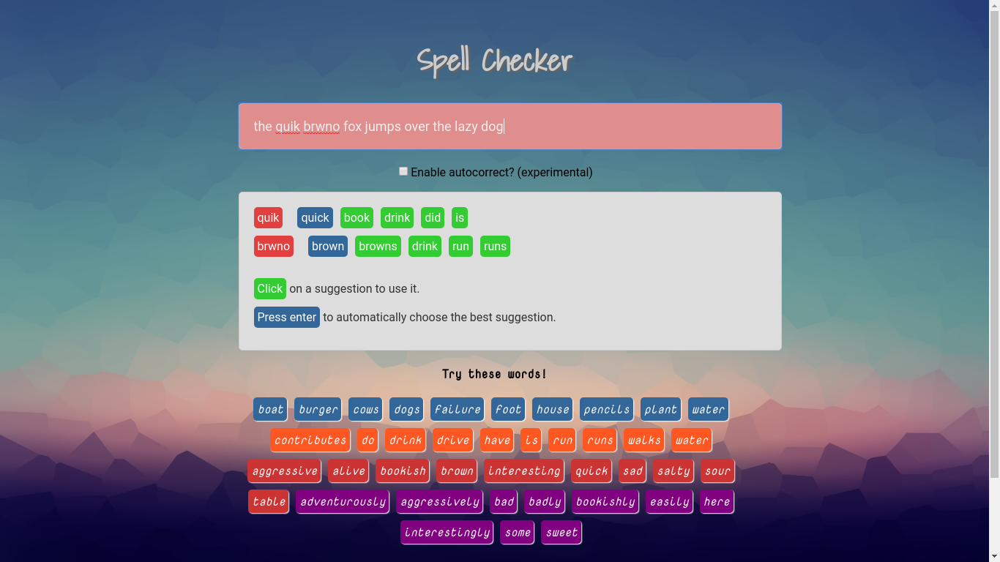

# JS + PHP spellchecker

To use this, you need to have PHP and MySQL server installed on your system.

Create a "connection.php" file in the root directory containing - 

````php
<?php
    $connection = new PDO("mysql:host=localhost;dbname=xyz", "username", "password");
?>
````
  
Import the spellcheck.sql file to your MySQL server to use the word and user database.

##### Screenshot

